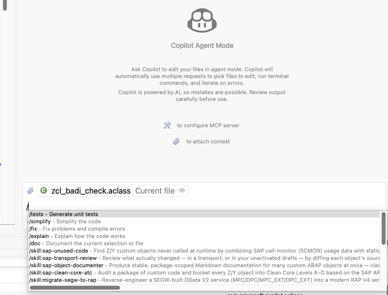

# Skills

ARC-1 ships reusable agent skills in the repository's [`skills/`](https://github.com/arc-mcp/arc-1/tree/main/skills) folder.

This page is the published index for those files. The canonical copies stay in `skills/` so users can copy them directly into Claude, Copilot, Cursor, Codex, or another assistant without scraping the docs site.

See the full source catalog in [`skills/README.md`](https://github.com/arc-mcp/arc-1/blob/main/skills/README.md).

!!! tip "Fastest path for Claude Code"
    Install the [Claude Code plugin](install-in-claude.md#claude-code-plugin-server-skills) — it
    bundles the ARC-1 MCP server **and** every skill below in one step (`/plugin install
    arc-1@arc-1`). The per-assistant copy instructions below are for other tools and manual setups.

## What Skills Are

Skills are task-focused prompt files for common SAP development workflows with ARC-1. They are not server features and do not require code changes in ARC-1 itself. They package good tool usage patterns so the assistant starts from a better workflow.

Typical uses:

- create a RAP service stack from a natural-language description
- implement RAP validations and determinations
- generate ABAP Unit or CDS unit tests
- explain unfamiliar ABAP code with dependency context
- analyze a prior ARC-1 chat session for prompt and tool usage quality

## Install With The `skills` CLI

The easiest setup is the [`skills`](https://github.com/vercel-labs/skills#readme) CLI. Run it from the normal local project folder that your assistant can see:

```bash
# Preview available ARC-1 skills
npx skills add arc-mcp/arc-1 --list

# Install all ARC-1 skills into the current project
npx skills add arc-mcp/arc-1

# Install only for GitHub Copilot
npx skills add arc-mcp/arc-1 --agent github-copilot

# Install selected skills only
npx skills add arc-mcp/arc-1 \
  --agent github-copilot \
  --skill bootstrap-system-context \
  --skill generate-rap-service-researched

# Install globally for your user
npx skills add arc-mcp/arc-1 --agent github-copilot --global
```

The CLI knows Copilot-compatible paths such as `.agents/skills/<name>/` and `~/.copilot/skills/<name>/`. You can also copy skill directories manually when a locked-down workstation cannot run `npx`.

## How To Use Them

Choose the integration style that matches your assistant:

- **Claude Code**: install the [plugin](install-in-claude.md#claude-code-plugin-server-skills) (recommended — server + skills), run `npx skills add arc-mcp/arc-1`, or copy a skill folder into `.claude/skills/<name>/`
- **GitHub Copilot in VS Code / CLI / cloud agent**: install into `.agents/skills/<name>/`, `.github/skills/<name>/`, or `~/.copilot/skills/<name>/`
- **GitHub Copilot in Eclipse**: install into `.agents/skills/<name>/`, `.github/skills/<name>/`, or `~/.copilot/skills/<name>/` in a normal local Eclipse project; use **Enable Skills** and the `/skill:<name>` slash menu
- **Cursor**: install into `.agents/skills/<name>/` or `~/.cursor/skills/<name>/`
- **OpenAI Codex**: install into `.agents/skills/<name>/` or `~/.codex/skills/<name>/`
- **Generic tools**: paste the markdown into project instructions, system prompt, or reusable templates

These skills assume:

- ARC-1 is connected and working
- `mcp-sap-docs` is available when the skill asks for SAP documentation research

## GitHub Copilot In Eclipse With ADT

This is the Eclipse-specific setup that is easy to miss. Eclipse Copilot supports Agent Skills in Agent Mode, but the skills are not listed on the **Custom Agents** preference page. They appear in chat through the `/skill:<name>` slash menu and can enrich chat context when **Enable Skills** is turned on.

Keep a small normal local project in the same Eclipse workspace and put the `SKILL.md` folders there. Custom agents are a separate optional Copilot feature stored as `.github/agents/<name>.agent.md`; they are useful when you want a named ABAP persona, but they are not required for ARC-1 skills.

### Why It Helps

ARC-1 gives Copilot live SAP tools through MCP. Skills tell Copilot how to use those tools for repeatable ABAP workflows.

Together, Copilot in Eclipse can:

- bootstrap real system context before generating ABAP
- use the RAP, CDS, unit-test, migration, and Clean Core workflows instead of ad-hoc prompting
- read active or inactive ABAP objects through ARC-1 before editing
- run lint, syntax, ATC, activation, and transport checks as part of the workflow
- keep corporate ABAP guidelines in versioned `SKILL.md` files instead of long chat prompts

Skills are guidance, not an enforcement boundary. ARC-1 safety flags, API-key profiles, OIDC/XSUAA scopes, package allowlists, SAP authorization, and human review still decide what can happen.

### Eclipse Setup

1. Install or update **GitHub Copilot for Eclipse**, sign in, and use **Agent Mode**. Current Copilot for Eclipse supports Agent Mode, MCP, Custom Agents, and Agent Skills. Eclipse 2024-09 or newer is required for the Copilot extension.
2. Create a normal local folder. Pick the command for your OS:

   ```bash
   # macOS / Linux
   mkdir -p ~/ADT_ECLIPSE_ARC1
   ```

   ```powershell
   # Windows PowerShell
   New-Item -ItemType Directory -Force "$env:USERPROFILE\ADT_ECLIPSE_ARC1"
   ```

3. In Eclipse, choose **File** → **Open Projects from File System...** and import that folder into the same workspace as your ABAP projects. Use `~/ADT_ECLIPSE_ARC1` on macOS/Linux or `%USERPROFILE%\ADT_ECLIPSE_ARC1` on Windows.
4. If dot folders are hidden, open the Project Explorer view menu, go to **Filters and Customization**, and disable the `.* resources` filter.
5. Open a terminal in the local project folder and install skills:

   ```bash
   # macOS / Linux
   cd ~/ADT_ECLIPSE_ARC1
   npx skills add arc-mcp/arc-1 --agent github-copilot --list
   npx skills add arc-mcp/arc-1 --agent github-copilot
   ```

   ```powershell
   # Windows PowerShell
   Set-Location "$env:USERPROFILE\ADT_ECLIPSE_ARC1"
   npx skills add arc-mcp/arc-1 --agent github-copilot --list
   npx skills add arc-mcp/arc-1 --agent github-copilot
   ```

6. In Eclipse, open **Window** → **Preferences** → **GitHub Copilot** → **Chat** and turn on **Enable Skills**. This controls whether Agent Skills can enrich chat context.
7. Start a new Copilot Chat in **Agent Mode**, type `/`, and confirm entries such as `/skill:sap-unused-code` or `/skill:generate-rap-service` appear. Use a skill explicitly with `/skill:<name>`, or ask a task that matches a skill description and let Copilot load relevant context.



### Optional Custom Agent

Use a custom agent only if you want a named ABAP/ARC-1 persona in the agent selector. Custom agents live under `.github/agents/<name>.agent.md` and are managed from **Window** → **Preferences** → **GitHub Copilot** → **Custom Agents**. They are separate from skills; creating one is not required for `/skill:*` entries to work.

Example `.github/agents/arc1-abap.agent.md`:

```markdown
---
name: arc1-abap
description: SAP ABAP development in Eclipse ADT using ARC-1 MCP tools and ARC-1 workflow guidance.
---

Prefer ARC-1 MCP tools for SAP work when they are available:
SAPRead, SAPSearch, SAPContext, SAPLint, SAPDiagnose, SAPActivate,
SAPTransport, SAPWrite, SAPGit, SAPQuery, and SAPManage.

Before changing ABAP, read the existing object and relevant dependencies,
then run lint, syntax, ATC, activation, and transport checks appropriate to
the change. Treat ARC-1 server safety settings and SAP authorization as
authoritative.
```

### Optional Copilot Instructions

If your team also wants always-on instructions, keep them short and separate from the detailed skills. Eclipse gives you two practical options:

- **Workspace instructions**: open **Window** → **Preferences** → **GitHub Copilot** → **Custom Instructions**, check **Enable workspace instructions**, and paste a short baseline into the workspace text box. This is local to the Eclipse workspace.
- **Project instructions**: add `.github/copilot-instructions.md` in the local skills project. Eclipse lists only open projects that contain this file in the **Project** table on the Custom Instructions page.

The **Load custom instructions from** dropdown controls which Eclipse projects contribute those instruction files to chat context, for example all projects in the workspace or only referenced projects. It does not install or manage Agent Skills.

Example `.github/copilot-instructions.md`:

```markdown
When working on SAP ABAP with ARC-1, inspect available SKILL.md files under
.agents/skills, .github/skills, and user-scoped Copilot skill folders.
Use the skill whose frontmatter description matches the task.

Prefer this baseline:
- run bootstrap-system-context before work on an unfamiliar system
- read existing ABAP objects with ARC-1 before changing them
- prefer SAPLint, SAPDiagnose, SAPActivate, and SAPTransport checks before finalizing
- do not treat skills as permission; ARC-1 server safety settings and SAP authorization are authoritative
```

Keep workspace or project instructions short. Put detailed ABAP, RAP, Clean Core, or company rules into separate skills so Copilot can load them only when relevant.

### ARC-1 MCP In Eclipse

In Copilot Chat, choose **Configure Tools...** or open **Preferences** → **GitHub Copilot** → **MCP**.

Use one of these ARC-1 connection patterns:

**Local quickstart-style `npx` config** — Eclipse starts ARC-1 directly as an MCP server. This is the same local shape as the [Quickstart](quickstart.md), adapted for Copilot's MCP configuration:

```json
{
  "servers": {
    "arc1-local": {
      "command": "npx",
      "args": ["-y", "arc-1@latest"],
      "env": {
        "SAP_URL": "https://your-sap-host:44300",
        "SAP_USER": "YOUR_USER",
        "SAP_PASSWORD": "YOUR_PASS",
        "SAP_CLIENT": "100"
      }
    }
  }
}
```

On Windows, if Eclipse cannot resolve `npx`, use `"command": "npx.cmd"` or the absolute path returned by `where.exe npx`.

**BTP Cloud Foundry URL login** — use this when ARC-1 is deployed centrally with XSUAA/OAuth. Configure only the `/mcp` URL and let Copilot complete the browser login:

```json
{
  "servers": {
    "arc1-btp": {
      "url": "https://arc1-mcp-<space>.cfapps.<landscape>.hana.ondemand.com/mcp"
    }
  }
}
```

See [Quickstart](quickstart.md), [BTP Cloud Foundry Deployment](btp-cloud-foundry-deployment.md), and [XSUAA Setup](xsuaa-setup.md) for the full server-side setup details.

### Troubleshooting

- Use a new Agent Mode chat after adding or updating skills.
- Check that the local skills folder is imported as an Eclipse project, not just present on disk.
- Confirm **Enable Skills** is turned on under **Window** → **Preferences** → **GitHub Copilot** → **Chat**.
- Type `/` in a fresh Agent Mode chat and look for `/skill:<name>` entries. If newly added skills do not appear, close the chat and restart Eclipse.
- Skills do not appear in the **Custom Agents** table; that table is only for `.github/agents/<name>.agent.md`.
- Custom instructions are separate from skills. Use the workspace text box or a project `.github/copilot-instructions.md` only for a short always-on baseline.
- On Windows, `~` means your user profile; in PowerShell examples use `$env:USERPROFILE`, and in Explorer paths use `%USERPROFILE%`.
- Keep one local skills project in the workspace instead of scattering instruction files across many ABAP projects.
- If an XSUAA/OIDC MCP login gets stale in Eclipse, see [XSUAA Setup → Eclipse GitHub Copilot](xsuaa-setup.md#eclipse-github-copilot).

References: [SAPDEV.EU Agentic Skills for ABAP Development](https://www.sapdev.eu/agentic-skills-for-abap-development/), [GitHub Copilot for Eclipse](https://github.com/microsoft/copilot-for-eclipse), [GitHub Changelog: Copilot in Eclipse skills and custom-instructions preference](https://github.blog/changelog/2026-06-02-github-copilot-in-eclipse-byok-skills-and-chat-updates/), [GitHub Docs: MCP in Eclipse](https://docs.github.com/en/copilot/how-tos/provide-context/use-mcp-in-your-ide/extend-copilot-chat-with-mcp), [GitHub Docs: custom agents in Eclipse](https://docs.github.com/en/copilot/how-tos/use-copilot-agents/cloud-agent/create-custom-agents-in-your-ide), and [`skills` CLI](https://github.com/vercel-labs/skills#readme).

## GitHub Copilot In VS Code With SAP ADT

SAP's **ABAP Development Tools for VS Code** extension gives VS Code an ABAP workspace, language-server-backed editing, activation, debugging, ABAP Unit, ATC, transport workflows, and SAP's ADT MCP server. ARC-1 skills add the repeatable agent workflows on top: how to bootstrap system context, inspect objects, generate RAP/CDS artifacts, run checks, and review results.

Do not put detailed ABAP style guides into one large Copilot instruction file. Put task-specific workflows in `SKILL.md` files and keep always-on instructions small.

### Recommended Workspace Shape

Use a multi-root workspace with both:

- one normal local folder for AI assets, for example `~/ADT_VSCODE_ARC1` on macOS/Linux or `%USERPROFILE%\ADT_VSCODE_ARC1` on Windows
- one or more ABAP destinations or packages added by the SAP ADT extension

In VS Code:

1. Install **ABAP Development Tools for VS Code** and **GitHub Copilot**.
2. Use the Command Palette command **ABAP: New Destination**.
3. Add ABAP context to the workspace with **ABAP: Add Package as Folder to Workspace...** or **ABAP: Add Destination as Folder to Workspace...**.
4. Add a normal local folder with **File** → **Add Folder to Workspace...**. This folder holds skills, instructions, generated `system-info.md`, and optional local ABAP mirrors.
5. Save the workspace with **File** → **Save Workspace As...** so VS Code reopens both the ABAP package/destination and the local AI folder together.

Example local folder setup:

```bash
# macOS / Linux
mkdir -p ~/ADT_VSCODE_ARC1
cd ~/ADT_VSCODE_ARC1
npx skills add arc-mcp/arc-1 --agent github-copilot --list
npx skills add arc-mcp/arc-1 --agent github-copilot
```

```powershell
# Windows PowerShell
New-Item -ItemType Directory -Force "$env:USERPROFILE\ADT_VSCODE_ARC1"
Set-Location "$env:USERPROFILE\ADT_VSCODE_ARC1"
npx skills add arc-mcp/arc-1 --agent github-copilot --list
npx skills add arc-mcp/arc-1 --agent github-copilot
```

VS Code Copilot discovers project skills from `.github/skills/<name>/SKILL.md`, `.claude/skills/<name>/SKILL.md`, or `.agents/skills/<name>/SKILL.md`, and personal skills from `~/.copilot/skills/<name>/SKILL.md`, `~/.claude/skills/<name>/SKILL.md`, or `~/.agents/skills/<name>/SKILL.md`.

On Windows, those personal paths live under your user profile, for example `%USERPROFILE%\.copilot\skills\<name>\SKILL.md`.

Use **Chat: Open Customizations** or type `/skills` in Copilot Chat to inspect available skills. Start a new Agent Mode chat after adding or updating skills.

### ARC-1 MCP Or SAP ADT MCP

The ARC-1 skills in this repository are written against ARC-1 tool names such as `SAPRead`, `SAPWrite`, `SAPContext`, `SAPLint`, and `SAPDiagnose`. For best results, configure ARC-1 as an MCP server in VS Code when using these skills.

Workspace `.vscode/mcp.json` for a centrally hosted ARC-1 server:

```json
{
  "inputs": [
    {
      "id": "arc1-api-key",
      "type": "promptString",
      "description": "ARC-1 API key",
      "password": true
    }
  ],
  "servers": {
    "arc1": {
      "type": "http",
      "url": "https://arc1.company.com/mcp",
      "headers": {
        "Authorization": "Bearer ${input:arc1-api-key}"
      }
    }
  }
}
```

Local ARC-1 development is still useful with SAP ADT for VS Code:

```bash
npx arc-1@latest \
  --transport http-streamable \
  --http-addr 127.0.0.1:3000 \
  --url https://your-sap-host:44300 \
  --user YOUR_USER \
  --password YOUR_PASS
```

Then configure:

```json
{
  "servers": {
    "arc1-local": {
      "type": "http",
      "url": "http://127.0.0.1:3000/mcp"
    }
  }
}
```

SAP's bundled ADT MCP server is a separate MCP surface. Follow SAP's [Configuring ADT MCP Server](https://help.sap.com/docs/abap-cloud/abap-development-tools-for-visual-studio-code/configuring-adt-mcp-server-ed94320814734d97801f51a5b6deb802?locale=en-US) guide, then enable its tools in Copilot's tool picker. That is useful when you want Copilot to operate through SAP's extension-managed session. The ARC-1 skills still help as workflow guidance, but tool names and parameters differ; if you use SAP's ADT MCP server without ARC-1, adapt the skill wording or add a small Copilot instruction telling the agent to translate ARC-1 tool steps to the ADT MCP tools that are enabled in this workspace.

When both ARC-1 and SAP ADT MCP tools are enabled, be explicit in the prompt:

> Use the ARC-1 skills and ARC-1 MCP tools for the workflow. Use the SAP ADT VS Code extension workspace for editor context and manual review.

### Minimal VS Code Instructions

Optional `.github/copilot-instructions.md` in the local AI folder:

```markdown
For SAP ABAP work, prefer the available ARC-1 SKILL.md files.
Load the skill whose frontmatter description matches the task.

Use ARC-1 MCP tools for skill steps that mention SAPRead, SAPWrite,
SAPContext, SAPLint, SAPDiagnose, SAPActivate, SAPTransport, or SAPGit.
Use SAP ADT for VS Code workspace context for editor navigation and manual review.

Before creating or changing ABAP objects:
- bootstrap system context when the system is unfamiliar
- read existing objects before editing
- run lint/syntax/ATC/activation checks appropriate to the change
- keep tool auto-approval narrow; server safety settings and SAP authorization are authoritative
```

This is intentionally short. Put Clean ABAP, RAP, CDS, migration, and company-specific rules into skills so Copilot loads them only when relevant.

### Practical Workflow

1. Open the saved VS Code workspace containing the local AI folder and the ADT package/destination folders.
2. Log on to the ABAP destination through the SAP ADT extension.
3. Start or verify ARC-1 MCP in **MCP: List Servers**.
4. In Copilot Chat, switch to **Agent** mode and enable only the MCP tools needed for the task.
5. Ask for a skill-backed workflow, for example:

   > Use the ARC-1 `bootstrap-system-context` skill for this ADT workspace, then summarize which RAP/CDS generation skills fit this system.

6. Review generated ABAP in the ADT editor, then run activation, ABAP Unit, ATC, and transport checks before accepting the result.

### Troubleshooting

- If skills are not listed, make sure the local AI folder is an open VS Code workspace folder and the skills are under `.github/skills`, `.claude/skills`, `.agents/skills`, or a supported user folder.
- If the workspace has only ABAP package/destination folders, add a normal local folder for Copilot customizations and generated local files.
- If Copilot ignores a new skill, start a new Agent Mode chat or reload the window.
- If ARC-1 tools are missing, run **MCP: List Servers**, start the server, and use **MCP: Reset Cached Tools** after changing server versions or tool modes.
- If SAP ADT MCP tools are missing, check the SAP ADT extension settings, then enable the ADT MCP tools in Copilot's tool picker.
- Avoid enabling every write-capable tool by default. Keep ARC-1 server safety flags, package allowlists, and Copilot tool approvals aligned with the system you are working in.

References: [ABAP Development Tools for VS Code marketplace page](https://marketplace.visualstudio.com/items?itemName=SAPSE.adt-vscode), [SAP Help: ABAP Development Tools for VS Code](https://help.sap.com/docs/abap-cloud/abap-development-tools-for-visual-studio-code/abap-development-tools-for-visual-studio-code), [SAP Help: Configuring ADT MCP Server](https://help.sap.com/docs/abap-cloud/abap-development-tools-for-visual-studio-code/configuring-adt-mcp-server-ed94320814734d97801f51a5b6deb802?locale=en-US), [VS Code Agent Skills](https://code.visualstudio.com/docs/agent-customization/agent-skills), [VS Code MCP servers](https://code.visualstudio.com/docs/agent-customization/mcp-servers), and [VS Code MCP configuration reference](https://code.visualstudio.com/docs/agents/reference/mcp-configuration).

## Available Skills

### Creating And Generating

| Skill | What it does | Best for |
|---|---|---|
| [generate-rap-service](https://github.com/arc-mcp/arc-1/blob/main/skills/generate-rap-service/SKILL.md) | Creates a complete RAP service stack from a natural-language description, with provider-contract-aware UI/Web API generation | Fast prototyping and standard CRUD |
| [generate-rap-service-researched](https://github.com/arc-mcp/arc-1/blob/main/skills/generate-rap-service-researched/SKILL.md) | Researches the target system first, then plans and creates the RAP stack using impact analysis, revision history, formatter settings, and SAP docs | Production-quality work in real packages |
| [generate-rap-logic](https://github.com/arc-mcp/arc-1/blob/main/skills/generate-rap-logic/SKILL.md) | Implements RAP determinations and validations in an existing behavior pool with structured class reads and quickfix-aware validation | Filling in business logic after stack creation |
| [generate-cds-unit-test](https://github.com/arc-mcp/arc-1/blob/main/skills/generate-cds-unit-test/SKILL.md) | Generates CDS unit tests using the CDS Test Double Framework | CDS entities with calculations, joins, filters, or aggregations |
| [generate-abap-unit-test](https://github.com/arc-mcp/arc-1/blob/main/skills/generate-abap-unit-test/SKILL.md) | Generates ABAP Unit tests with dependency analysis and test doubles | Classes with meaningful business logic |
| [generate-analytics-star-schema](https://github.com/arc-mcp/arc-1/blob/main/skills/generate-analytics-star-schema/SKILL.md) | Generates a CDS analytical model with cube, dimension, and text views | Embedded analytics foundations |
| [generate-cds-analytical-query](https://github.com/arc-mcp/arc-1/blob/main/skills/generate-cds-analytical-query/SKILL.md) | Generates an analytical query projection on an existing cube | Exposing consumable KPI queries |

### Analyzing And Understanding

| Skill | What it does | Best for |
|---|---|---|
| [explain-abap-code](https://github.com/arc-mcp/arc-1/blob/main/skills/explain-abap-code/SKILL.md) | Reads an ABAP object, pulls dependency context, and explains it in structure | Onboarding, debugging, and code comprehension |
| [migrate-custom-code](https://github.com/arc-mcp/arc-1/blob/main/skills/migrate-custom-code/SKILL.md) | Runs migration-oriented checks and groups findings by priority | S/4HANA migration and ABAP Cloud readiness |
| [sap-object-documenter](https://github.com/arc-mcp/arc-1/blob/main/skills/sap-object-documenter/SKILL.md) | Batch-documents custom objects as Markdown | Package onboarding and handoffs |

### Clean Core And Custom Code Retirement

| Skill | What it does | Best for |
|---|---|---|
| [sap-clean-core-atc](https://github.com/arc-mcp/arc-1/blob/main/skills/sap-clean-core-atc/SKILL.md) | Audits custom code and buckets findings into Clean Core levels | ECC to S/4HANA Cloud or BTP planning |
| [sap-unused-code](https://github.com/arc-mcp/arc-1/blob/main/skills/sap-unused-code/SKILL.md) | Combines runtime usage and static where-used analysis | Custom-code retirement scoping |

### Legacy Migration And UI

| Skill | What it does | Best for |
|---|---|---|
| [migrate-segw-to-rap](https://github.com/arc-mcp/arc-1/blob/main/skills/migrate-segw-to-rap/SKILL.md) | Reverse-engineers a SEGW OData V2 service into RAP V4 artifacts | S/4HANA modernization |
| [convert-ui5-to-fiori-elements](https://github.com/arc-mcp/arc-1/blob/main/skills/convert-ui5-to-fiori-elements/SKILL.md) | Generates a Fiori Elements V4 LROP app against a V4 service | Annotation-driven standard UI |
| [modernize-ui5-app](https://github.com/arc-mcp/arc-1/blob/main/skills/modernize-ui5-app/SKILL.md) | Modernizes a legacy UI5 freestyle JavaScript app to UI5 TypeScript | Custom UI5 apps that do not fit Fiori Elements |

### System Context And Local Workflow

| Skill | What it does | Best for |
|---|---|---|
| [bootstrap-system-context](https://github.com/arc-mcp/arc-1/blob/main/skills/bootstrap-system-context/SKILL.md) | Probes the target system and writes a local `system-info.md` with SID, release, installed components, feature flags, and lint preset | First step of a session against an unfamiliar system — grounds later prompts in real constraints |
| [setup-abap-mirror](https://github.com/arc-mcp/arc-1/blob/main/skills/setup-abap-mirror/SKILL.md) | Creates a local abapGit-style mirror of a package or object list using ARC-1's existing reads | Onboarding a codebase, pre-migration snapshotting, feeding IDE context to tools that cannot call MCP per read |

### Meta And Quality

| Skill | What it does | Best for |
|---|---|---|
| [analyze-chat-session](https://github.com/arc-mcp/arc-1/blob/main/skills/analyze-chat-session/SKILL.md) | Reviews a prior ARC-1 conversation and identifies inefficient tool usage or prompt patterns | Improving team workflows and prompt hygiene |

## Recommended Starting Points

- Run `bootstrap-system-context` first when starting a session against an unfamiliar system — it grounds every later prompt in real constraints.
- Run `setup-abap-mirror` after bootstrap to pull a package into local abapGit-style files for IDE context and `git diff`.
- Start with `generate-rap-service` when the goal is speed and the design is straightforward.
- Start with `generate-rap-service-researched` when writing into transportable packages or when team conventions matter.
- Use `explain-abap-code` before editing unfamiliar objects.
- Use the unit-test skills after generating or modifying non-trivial behavior.

## Recent ARC-1 Features These Skills Exploit

- `SAPContext(action="impact")` for RAP/CDS reuse and dependency analysis
- `SAPRead(type="VERSIONS")` / `SAPRead(type="VERSION_SOURCE")` for safer edits of existing RAP stacks
- `SAPTransport(action="history")` for object-to-transport traceability
- `SAPLint(action="format" | "get_formatter_settings")` for SAP-native formatting
- `SAPRead` / `SAPWrite` for `SKTD` so RAP artifacts can carry attached Markdown documentation
- `SAPGit` for abapGit / gCTS-aware package workflows when available

## Why The Files Stay In `skills/`

Keeping canonical skill files in `skills/` has two advantages:

- they stay copyable as plain prompt assets for any assistant
- docs can explain and link to them without turning the published site into the source of truth

That split keeps the repo practical for both humans and tooling.
